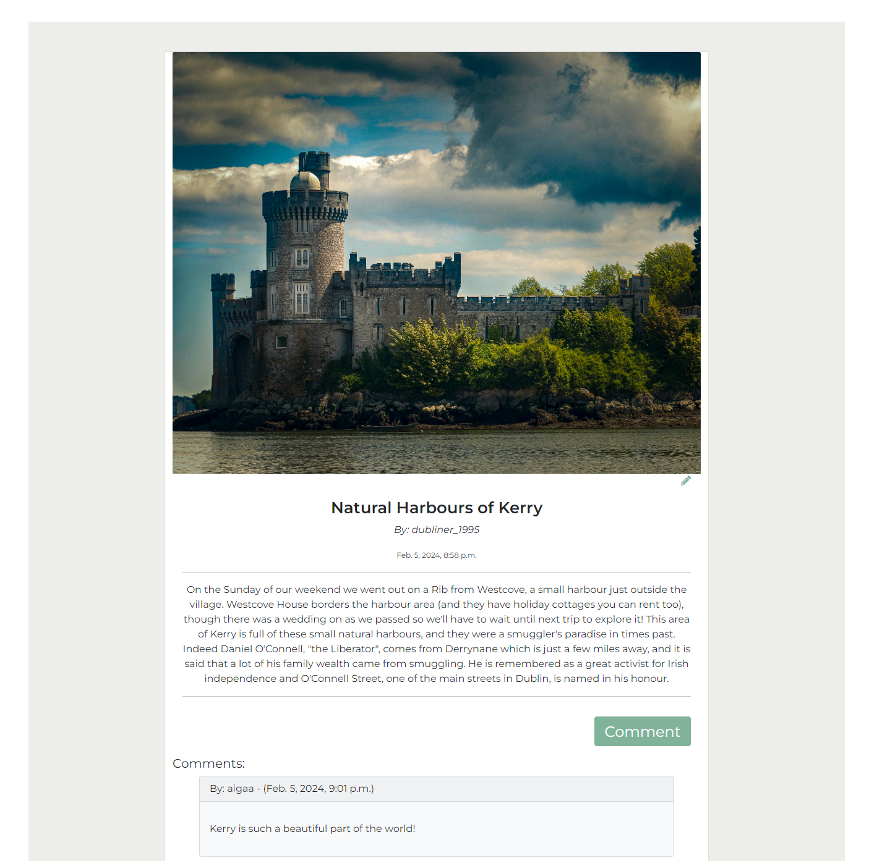
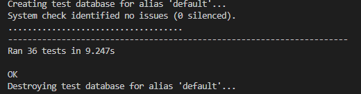

# Passport Pages

Web application for travel enthusiasts that wishes to share the travel stories.
  

Fully published website is here: [Passport Pages](https://passport-pages-4af24cae3d46.herokuapp.com/)

## Table of Contents
- [About](#about)
    - [Site purpose](#site-purpose)
    - [Target audience](#target-audience)
    - [Goals](#goals)
- [Structure](#structure)
    - [Website Pages](#website-pages)
    - [Code Structure](#code-structure)
    - [Database](#database)
    - [User Stories](#user-stories)
- [Design](#design)
    - [Wireframes](#wireframes)
    - [Color Scheme](#color-scheme)
    - [Typography](#typography)
    - [Images](#images)
- [Features](#features)
    - [Website Features](#website-features)
    - [Future Implementations](#future-implementations)
- [Technologies Used](#technologies-used)
    - [Main Languages Used](#languages)
    - [Frameworks, Libraries & Programs Used](#frameworks)
- [Testing](#testing)
    - [Automated Tests](#automated-tests)
    - [Validation](#validation)
- [Deployment](#deployment)
    - [Local Deployment](#local-deployment)
    - [Heroku](#heroku)
- [Credits](#credits)


## About <a name="about"></a>

Passport Pages is web application that can be used for anyone who wants to share their travel stories with community.


### Site Purpose <a name="site-purpose"></a>
- Create stories, be able to edit stories.
- Leave a comment to the shared stories. 

### Target Audience <a name="target-audience"></a>
- This site is developed for anyone who is passionate about travel.
- This site is developed for anyone who likes to share their travel experiences.
- This site is developed with thaught that it easy accessable to all users. Compatibility with different device sizes makes the contect easy accessible and readable on desktop or the mobile device.


### Goals <a name="goals"></a>
- To bring some positivity and to create fun environtment for its users.
- To offer a user-friendly platform.
- To produce code that complies with best practices.


## Structure <a name="structure"></a>
### Website Pages <a name="website-pages"></a>
Website pages described below

| Page | Description |
| --- | --- |
| Home | Home page displays a hero image and the latest three added stories. There is additional jumbotron with inviting text and a SignUp button. |
| Stories | Show the list of all stories that have been posted by website users. |
| My Blog | Show the list of all stories that the current registered user has been posted. |
| Edit Page | The user can edit or delete the story. |
| Create Story | The user can create a new story. |
| One story page (Public) | Show the full article and allow to add a comment (only if user has been registered). |
| Add comment | The registered website user can add comment to the post they have selected. |
| Login | The website user can login to their account. |
| Logout | The website user can logout of their account. |
| Register | The website user can register a new account. |


### Code Structure <a name="code-structure"></a>
- The project contains one app 'blog'.
- The aprojects app handles all data.
- The project also have files: 
    - templates
    - README.md
    - Procfile
    - requirements.txt
- The project was built on basis of Django Blog project from Code Institute that was part of a walkthrough app.

### Database <a name="database"></a>
The databas diagram is shown below:


#### Models
- User
    - User model is part of an allauth Django library. 
    - Fields used for this project were: username, email, password

- Post
    - Post model is the main model.
    - Posts can be seen by anyone who is viewing the webiste.
    - The user must register, if they wish to create a post. 
    - Only that posts user can edit or delete the post.
    - Images added to the post are saved within Cloudinary. 

- Comment
    - Comment model is related to Post and a User. 
    - Comments can be made only registered users. 

### User Stories <a name="user-stories"></a>

All website users/visitors: 
- As a **user** I can **create an account** so that **I can create, update and delete posts**
- As a **user** I can **view posts published** so that **I can select the one I wish to read about more**
- As a **user** I can **select and open an individual post** so that **I can read a full story**

Registered website users:
- As a **registered user** I can **create my own posts** so that **I can share them on the blog for other users to read them**
- As a **registered user** I can **comment on other posts** so that **I can share my own insight on the story. or leave a comment for the creator**
- As a **registered user/content creator** I can **edit my own posts** so that **I can fix any typos or misspellings, or even update some information**
- As a **registered user/content creator** I can **delete my own posts** so that **I can clear any unwanted content**

Admin:
- As an **admin** I can **manage user accounts and posts** so that **no harmful/malicious content has been posted**


## Design <a name="design"></a>
### Wireframes <a name="wireframes"></a>
For this project Figma tool was used to create layout and design for the web application.

<details><summary>Wireframe screenshots</summary> 

- Summary: 
    - Website has a navbar when user is not logged in, they can see four links: Home, Stories, Login and SignUp. When user is logged in, there are two additional drop down menu items, that are linked to the users posts and create post pages.  
        Home page displays a hero image and last three added stories. There is additional jumbotron with inviting text and a SignUp button.
           

    - 'Stories' page is showing the list of all stories that have been posted by website users. 
          

    - 'Read More' redirects to one stories page where the full article can be read comments are shown (if there are any). Additionally there is a button 'Comment' that allows user to post a comment to the story, this is allowed only if the user has logged in. 
          

    - 'Create/Edit' pages will be for use of a new story creations, or editing, respectively
          

    - 'My Blog' page will display only that user stories that have been created
          

    - Mobile layout of the web application
          

</details>


### Color Scheme <a name="color-scheme"></a>
The color palette for this project was taken from [coolors.co](https://coolors.co/) website.  
Background drop, linear gradient, for main page jumbotron was taken from [gradients.shecodes.io](https://gradients.shecodes.io/gradients/623).


### Typography <a name="typography"></a>
The typography for the project was used from [Google Fonts](https://fonts.googleapis.com/css2?family=Montserrat:ital,wght@0,300;0,400;0,600;1,300;1,400&family=Shadows+Into+Light&display=swap).
These are fonts that are used: Montserrat and Shadows Into Light (for logo only) If the browser does not support these fonts it should fall back to sans-serif.

### Images <a name="images"></a>
Images used in this project are taken from free images source [pexels.com](https://www.pexels.com/).
Placeholder image was custom made with [Canva](https://www.canva.com/).


## Features  <a name="features"></a>

### Website Features <a name="website-features"></a>

#### Main Page
- The website consists of the main responsive navbar 


- When user is logged in, there appears a dropdown menu to select to create a story or check all their own stories


- The main page has a latest 3 stories added to the page by the user, when clicked on the 'Read More' button, it will lead to that article specific only. 


- At the bottom of the main page, there is a inviting text and a sign-up button that redirects users to the sign-up page. 
- The footer has some social links included. 


#### A Selected Story
- On the one story page, the user can read a full article and leave a comment. 
- The user will be redirected to login page, if they are not registered user. 



#### All Stories
- All stories page are shown all stories that have been posted by various of users. 
- It is easy to spot which post is posted by the user, as there is a pencil (edit option) at the bottom of the post on all stories page.


#### Edit Page
- Edit page is accessible only by registered user. 
- When selecting edit option for the post, it will populate already posted content.
- If user does not want to make any changes, they can select Cancel option.
- If user wants to delete the post, select delete. This will redirect to confirmation page, if user is sure to delete this post. 
- If user has made all the changes needed, they can click on save. The message will appear on top left corner that post has been successfully saved. 


#### Create Story Page
- Create story is a blank form page, with option to write a story, add photo and post it. 
- If user does not want to post it, they can cancel it. 


#### All User Stories - User side only.
- Users story page shows all posted posted posts of that user. 
- The small icons pencil and a bin indicate that these can be edited or deleted accordingly.


### Future Implementations <a name="future-implementations"></a>

Some of the future implementations for this project is:
- Implement likes button, so that anyone reading a story can like it too.
- Implement checks if the post or comment that was posted were not malicious. 
- Implement edit user comment, so that the user that posted a comment can edit it, if they wish to. 
- create profile page for the user. 


## Technologies Used  <a name="technologies-used"></a>

### Main Languages Used <a name="languages"></a>

- HTML: Structure and content for the website
- CSS: Style and compatibilaty with different devices
- Python: Functions and logic implementation to features of a website

### Frameworks, Libraries & Programs Used <a name="frameworks"></a>

- [gitpod](https://www.gitpod.io/): To build the project
- [github](https://github.com/): To store files and repositories. Also often used to search thread for similar issues to resolve errors in the code
- [Heroku](https://heroku.com/): To deploy this web application
- [QuickDatabaseDiagrams](https://quickdatabasediagrams.com/): Create database diagram
- [Cloudinary](https://cloudinary.com/): To store saved images that have been posted by the user
- [Pexels](https://pexels.com/): For additional images to store into database
- [Canva](https://www.canva.com/): Create custom placeholder image
- [Figma](https://https://www.figma.com/): Wireframes
- [Bootstrap](https://getbootstrap.com/): Layouts, cards, buttons
- [FontAwesome](https://fontawesome.com/): Icons
- [Crispy Forms](https://django-crispy-forms.readthedocs.io/en/latest/install.html): Forms
- [Google Fonts](https://fonts.google.com/): For the fonts that are used across the project
- [Am I Responsive](https://ui.dev/amiresponsive): To check, if website looks good across multiple devices
- [Travel Guide](https://www.myirelandtour.com/travelguide/england/index.php): For content
- Google Chrome DevTools: This was used throught the project to debug and see the compatibilaty across multiple device sizes


## Testing  <a name="testing"></a>

### Automated Tests <a name="automated-tests"></a>
#### Unit tests
- Total of 36 tests were run for models/views/forms files. 




### Validation <a name="validation"></a>
#### HTML
- [HTML Validator](https://jigsaw.w3.org) was used to check HTML file.
- Some errors were found, as the Django code was dedecteed and this caused some issues with marking brackets '{ }' as invalid.
<details><summary>HTML Validation screenshots</summary>


</details>

#### CSS
- [CSS Validator](https://jigsaw.w3.org/css-validator) was used to check CSS file.
- No errors were found.
<details><summary>CSS Validation screenshots</summary>


</details>

#### Python 
- Online Validator [ExtendsClass](https://extendsclass.com/python-tester.html) was used to check Python file.
- No errors were found.
<details><summary>Python Validation screenshots</summary>


</details>

#### Lighthouse 
- Lighthouse Validator was used to check live website performance.
- Some errors were displayed, as image 
<details><summary>Lighthouse screenshots</summary>

- Main Page Performance results


- All Stories Page Performance results


- Some of the main issues within the performance report


</details>

#### Wave 
- [Wave](https://wave.webaim.org/) was used to check sites accessibility.
- Some errors appeared on contrast between some background colors and fonts.
<details><summary>Wave screenshots</summary>


</details>


## Deployment  <a name="deployment"></a>

Before getting to the deployment part, make sure you have set up accounts in [ElephantSQL](https://www.elephantsql.com/) and also [Cloudinary](https://cloudinary.com/).
You will keys provided by these two application to connect to the project and include them into your env.py file. 

### Local Deployment <a name="local-deployment"></a>

You can clone this repository and run it locally with the following steps:

- Login to GitHub (https://wwww.github.com)
- Select the repository [Passport Pages](https://github.com/AiGaA/passport-pages)
- Click the Code button and copy the HTTPS url, for example: https://github.com/AiGaA/passport-pages.git
- In your IDE, open a terminal and run the git clone command, for example: git clone https://github.com/AiGaA/passport-pages.git
- The repository will now be cloned in your workspace
- You will need to create your own env.py file and this should be added to .gitignore file too (so this is not commited and exposed to public) 
- In env.py add the following code with the relevant key, value pairs, and ensure you enter the correct key values

```
import os
os.environ['SECRET_KEY'] = 'ADDED_BY_YOU'
os.environ['DATABASE_URL'] = 'ADDED_BY_YOU'
os.environ['CLOUDINARY_URL'] = 'ADDED_BY_YOU'
```

- Install the relevant packages as per the requirements.txt file
- In the settings.py ensure the connection is set to either the Heroku postgres database or the local sqllite database
- Ensure debug is set to true in the settings.py file for local development
- Run "python3 manage.py makemigrations" to check the status of the migrations
- Run "python3 manage.py migrate" to migrate the database
- Run "python3 manage.py createsuperuser" to create a super/admin user
- Start the application by running python3 manage.py runserver and it will open a new window. 
- This will prompt with an error, and you will need to copy the url provided to your ALLOWED_HOSTS
- Run the project once more


### Heroku <a name="heroku"></a>

This project can be deployed to Heroku with the following steps:

- Ensure debug is set to false in the settings.py file
- Run "python3 manage.py makemigrations" to check the status of the migrations
- Run "python3 manage.py migrate" to migrate the database
- Run "python3 manage.py createsuperuser" to create a super/admin user
- Create an account on [Heroku](https://www.heroku.com/)
- Create an app, give it a name, and select a region
- Under resources search for postgres, and add a Postgres database to the app
- Note the DATABASE_URL, this needs to be set as an environment variable in Heroku and your local environment variables
- Create a Procfile with the text: web: gunicorn passportpages.wsgi
- Make sure you add your environment variables (env.py) to Heroku's Config Vars
- In the settings.py ensure the connection is to the Heroku postgres database
- Ensure debug is set to false in the settings.py file
- Add 'localhost', and 'passportpages.herokuapp.com' to the ALLOWED_HOSTS variable in settings.py
- Connect the app to GitHub, and enable automatic deploys from main
- Click deploy to deploy your application to Heroku for the first time

## Credits  <a name="credits"></a>

I wish to say big thank you for everyone at Code Institute (CI) and Slack community for great help on this project when stuck the most. 
The project was based on CI walkthrough project 'I think before I blog'.
Some repositories I found very helpful too: https://github.com/AlexGCbn/CI_PP4_Hike-a-thon/ and https://github.com/rnc-personal/ci-fullstack-pp4 